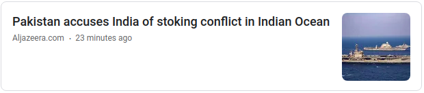

# GNews [](https://travis-ci.org/brh55/google-news-rss) [](https://coveralls.io/github/brh55/google-news-rss) 

> 🚩 A Python Package (with CLI support) that searches Google News RSS Feed and returns a usable JSON response \
> 🚩 As well as you can fetch full article



<p align="center">Coverts ⬇️</p>

```
{'publisher': 'Aljazeera.com',
 'description': 'Pakistan accuses India of stoking conflict in Indian Ocean  '
                'Aljazeera.com',
 'published date': 'Tue, 16 Feb 2021 11:50:43 GMT',
 'title': 'Pakistan accuses India of stoking conflict in Indian Ocean - '
          'Aljazeera.com',
 'url': 'https://www.aljazeera.com/news/2021/2/16/pakistan-accuses-india-of-nuclearizing-indian-ocean'}
```


## Install

``` 
pip install gnews
```

## Usage

```python
from GNews import GNews
google_news = GNews()
news = google_news.get_news('Pakistan')

```
**We can set country, language, period and size during initialization**

```python
google_news = GNews(language='en', country='US', period='7d', size=10)
```

On the bottom left side of the Google News page you may find a `Language & region` section where you can find all of the supported combinations.

## Article Properties
| Properties   | Description                                    | Example                                                                                                                                                                                                                                                                             |
|--------------|------------------------------------------------|-------------------------------------------------------------------------------------------------------------------------------------------------------------------------------------------------------------------------------------------------------------------------------------|
| title        | Title of the article                           | Why don't unicorns exist? You asked Google – here's the answer ... - The Guardian                                                                                                                                                                                                   |
| url         | Google news link to article                    | [Article Link](http://news.google.com/news/url?sa=t&fd=R&ct2=us&usg=AFQjCNGNR4Qg8LGbjszT1yt2s2lMXvvufQ&clid=c3a7d30bb8a4878e06b80cf16b898331&cid=52779522121279&ei=VQU7WYjiFoLEhQHIs4HQCQ&url=https://www.theguardian.com/commentisfree/2017/jun/07/why-dont-unicorns-exist-google) |
| published date      | Published date                                 | Wed, 07 Jun 2017 07:01:30 GMT                                                                                                                                                                                                                                                       |
| description  | Short description of article                   | Why don't unicorns exist? You asked Google - here's the answer ...                                                                                                                                                                                                                  |
| publisher    | Publisher of article                           | The Guardian                                                                                                                                                                                                                                                                        |                                                                                                                                                        |

## License

MIT © 
